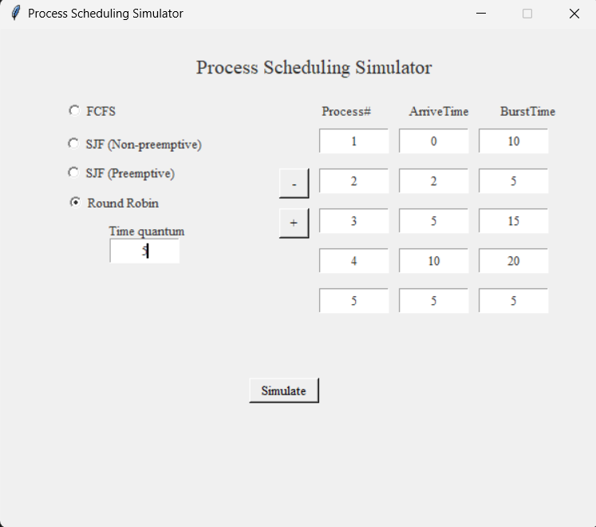
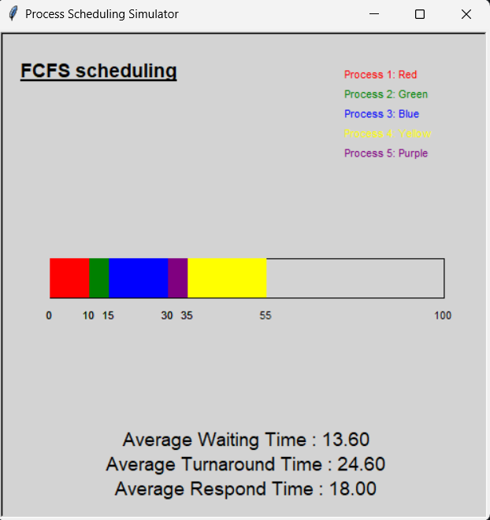
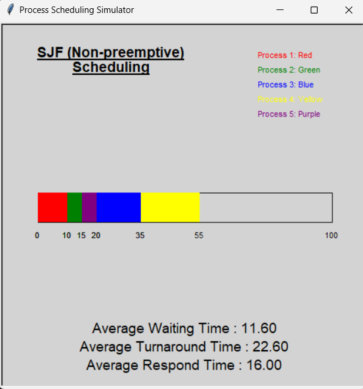
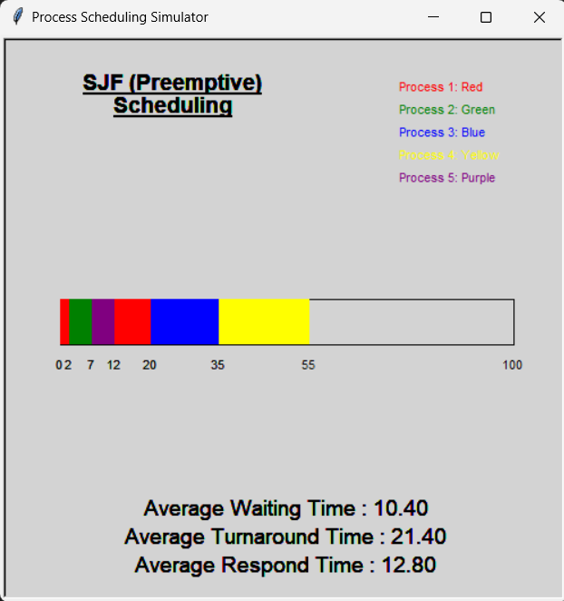
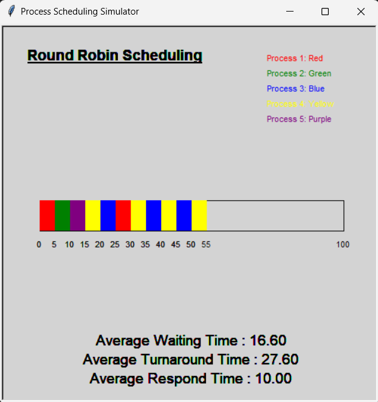

Process Scheduling Simulation (OS Semester Project)

This project is a graphical simulation of CPU process scheduling algorithms developed using Python, Tkinter, and Turtle graphics.
It visually demonstrates how different scheduling algorithms execute processes and helps in understanding core Operating System concepts.

This project was developed as part of the Operating Systems (OS) semester project.

📚 Table of Contents

Overview

Features

Technologies Used

Installation

How to Run

User Interface

Scheduling Algorithms

Working Mechanism

Screenshots

License

Author

🔍 Overview

The Process Scheduling Simulator provides a visual and interactive way to understand how CPU scheduling algorithms work.
Users can input process data and observe execution order using a Gantt Chart, along with calculated performance metrics.

✨ Features

📊 Gantt chart visualization of process execution

⚙️ Simulation of popular CPU scheduling algorithms:

FCFS

SJF (Preemptive & Non-Preemptive)

Round Robin

🧮 Automatic calculation of:

Waiting Time

Turnaround Time

Response Time

🖥️ Interactive GUI built using Tkinter

🎨 Visual execution using Turtle graphics

🛠️ Technologies Used

Python 3

Tkinter (GUI)

Turtle Graphics (Visualization)

Operating System Concepts

💻 Installation

Clone the repository

git clone https://github.com/Iqra-Hayder/Process-Scheduler.git

Navigate to the project folder

cd Process-Scheduler

✅ No external libraries required
Tkinter and Turtle come pre-installed with Python.

▶️ How to Run
python simulator.py

🖥️ User Interface

The simulator provides a simple and user-friendly interface consisting of:

Input Section

Process ID

Arrival Time

Burst Time

Algorithm Selection

Radio buttons to choose:

FCFS

SJF

Round Robin

Controls

Add or remove processes

Start simulation button

Output

Gantt chart visualization

Average waiting time

Average turnaround time

Average response time

⚙️ Scheduling Algorithms
🔹 First-Come, First-Served (FCFS)

Executes processes in the order they arrive

Non-preemptive

Simple but may cause long waiting times

🔹 Shortest Job First (SJF)

Executes the process with the shortest burst time

Available in:

Preemptive

Non-preemptive

Minimizes average waiting time

🔹 Round Robin (RR)

Each process gets a fixed time quantum

Preemptive algorithm

Ideal for time-sharing systems

🔄 Working Mechanism

User inputs process data

Selects a scheduling algorithm

Simulator executes algorithm logic

Turtle draws Gantt chart

Performance metrics are calculated and displayed

🖼️ Screenshots
User Interface

  

FCFS Output

  

SJF (Non-Preemptive)

  

SJF (Preemptive)

  

Round Robin

  

📄 License

This project is licensed under the MIT License.
See the LICENSE
 file for details.

👩‍💻 Author

Iqra Hayder
GitHub: https://github.com/Iqra-Hayder
